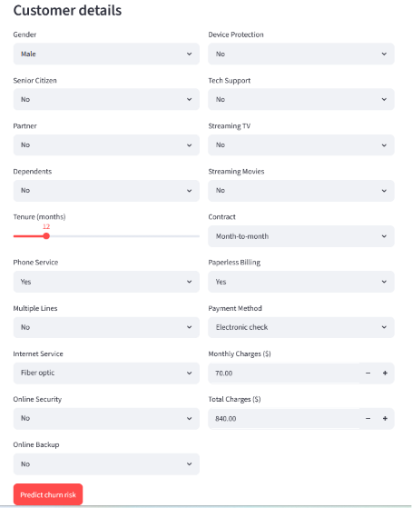
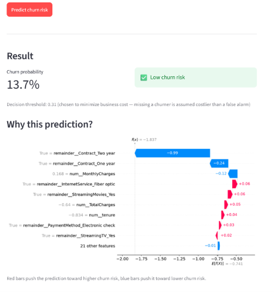

# Telco Customer Churn Prediction

A cost-sensitive churn prediction pipeline comparing Logistic Regression, Random Forest, LightGBM, and a soft-voting ensemble — with an interactive Streamlit app for live predictions and SHAP-based explanations.

**Live demo:** [https://telco-churn-predictor-1927.streamlit.app/](#)
**Notebook:** [`notebooks/churn_pipeline.ipynb`](notebooks/churn_pipeline.ipynb)

---

## Problem

Customer churn — when a subscriber cancels their service — is expensive to a business primarily because acquiring a new customer almost always costs more than retaining an existing one. The goal of this project is to predict which customers are at risk of churning *before* they leave, so a retention team can intervene early.

**Dataset:** [IBM Telco Customer Churn](https://www.kaggle.com/datasets/blastchar/telco-customer-churn) — 7,043 customers, 19 features (demographics, account info, services subscribed), binary target (`Churn`: Yes/No).

**Class balance:** ~27% churn, ~73% retained. This imbalance is the reason accuracy is the wrong metric for this problem — a model that never predicts churn would score ~73% accuracy while being completely useless. Every evaluation choice below follows from taking that seriously.

---

## Pipeline & Preprocessing

- **`TotalCharges` fix** — read in as a string column due to 11 rows with a blank value (customers with `tenure == 0`, not yet billed). Converted via `pd.to_numeric(errors='coerce')` and filled with `0`.
- **`ColumnTransformer`** — `StandardScaler` applied to numeric columns (`tenure`, `MonthlyCharges`, `TotalCharges`), one-hot encoding applied to categorical columns, `remainder='passthrough'`.
- **Wrapped in a single `sklearn.Pipeline`** per model (preprocessing + classifier as one object). This guarantees:
  - No data leakage — the transformer is fit only on training folds during cross-validation.
  - One artifact to save/load (`joblib.dump`) instead of juggling a separate scaler, encoder, and model.
  - Identical preprocessing logic across all four models for a fair comparison.

---

## Models Trained

| Model | Tuning approach |
|---|---|
| Logistic Regression | `RandomizedSearchCV` over `penalty` (L1/L2), `C`, `class_weight='balanced'` |
| Random Forest | `RandomizedSearchCV` over `max_depth`, `n_estimators`, `min_samples_split`, `class_weight='balanced'` |
| LightGBM | No grid search — `scale_pos_weight` for imbalance, early stopping (50 rounds) on a held-out validation split to select tree count automatically |
| Soft-Voting Ensemble | Simple average of the three models' `predict_proba` outputs |

LightGBM's early stopping converged at **iteration 8** — out of a budget of 1,000 trees — suggesting most of the model's predictive signal is captured by a small number of strong splits rather than deep interaction effects. This observation is consistent with the SHAP results below.

---

## The Threshold Problem

PR-AUC (precision-recall AUC) is the right metric for *ranking* model quality on imbalanced data, but it summarizes performance across *all* thresholds — it doesn't hand you a deployable decision rule. A real system needs one specific probability cutoff above which a customer is flagged as "at risk."

Three candidate thresholds were compared per model:

1. **Blind 0.5** — the default, arbitrary cutoff.
2. **F1-optimal** — the threshold that maximizes the harmonic mean of precision and recall.
3. **Cost-optimal** — the threshold that minimizes a custom cost function:

```python
def optimize_threshold_for_cost(y_true, y_probs, cost_fn=5, cost_fp=1):
    thresholds = np.linspace(0.01, 0.99, 99)
    costs = []
    for t in thresholds:
        preds = (y_probs >= t).astype(int)
        tn, fp, fn, tp = confusion_matrix(y_true, preds).ravel()
        cost = fn * cost_fn + fp * cost_fp
        costs.append(cost)
    return thresholds[np.argmin(costs)]
```

**Why cost-optimal over F1-optimal:** F1 treats false positives and false negatives as equally costly. For churn, they aren't. A false negative (missed churner) means losing that customer's revenue entirely. A false positive (flagging a customer who wasn't actually leaving) just means an unnecessary retention offer — annoying and a minor cost, but far cheaper than losing the customer outright.

The `cost_fn=5, cost_fp=1` ratio used here is **illustrative**, not derived from real Telco financials (this dataset has no CAC or LTV columns). In a production setting, these would be replaced with actual figures:
- `cost_fp` ≈ customer acquisition cost (CAC) or the cost of a retention discount
- `cost_fn` ≈ average customer lifetime value (LTV) lost

The function is parameterized specifically so this swap requires no retraining — only a re-run of the threshold sweep — so a retention team can update the operating point as real cost data becomes available, without touching the model itself.

---

## Model Comparison

Evaluated at each model's individual cost-optimal threshold:

| Model | Threshold | PR-AUC | Recall (churn) | Precision (churn) | F1 |
|---|---|---|---|---|---|
| Logistic Regression | 0.31 | 0.636 | 0.928 | 0.435 | 0.592 |
| Random Forest | 0.37 | 0.656 | 0.853 | 0.497 | 0.628 |
| LightGBM | 0.28 | 0.635 | 0.914 | 0.429 | 0.584 |
| Soft-Voting Ensemble | 0.26 | 0.651 | **0.939** | 0.423 | 0.584 |

**Reading this table against the project's stated priority (recall):**
- Random Forest has the **best PR-AUC and F1**, edging out the other models slightly.
- The **soft-voting ensemble has the best recall** (93.9%) — by blending three independently-trained probability estimates, it pushes slightly more borderline cases over the threshold than any single model does on its own.
- All four models cluster within a fairly narrow band on PR-AUC (0.635–0.656). This, combined with the SHAP results below, suggests the churn signal in this dataset is largely linear/additive — a more complex model architecture has limited room to extract additional structure.

---

## Deployed Model: LightGBM

The app deploys **LightGBM**, despite Random Forest and the ensemble showing marginally better PR-AUC/recall on the table above. The deciding factor was **interpretability**: LightGBM has native, fast `TreeExplainer` support in SHAP, enabling the live per-prediction waterfall explanations shown in the app. The performance gap between LightGBM and the top-performing alternatives is small enough that explainability was judged the more valuable trade for a demo focused on showing *why* a prediction was made, not just *what* it was.

---

## Interpretability (SHAP)

Global feature importance (SHAP summary plot) confirms the same pattern seen in the model comparison — a small number of features dominate:

- **Contract type** (`Two year`, `One year`) — having a longer-term contract strongly *reduces* predicted churn risk; month-to-month customers are the highest-risk group.
- **Tenure** — newer customers churn more; long-tenured customers churn less.
- **`InternetService_Fiber optic`** — fiber customers show *higher* churn risk in this dataset, consistent with known billing/service complaint patterns in this specific data.
- **`MonthlyCharges`** — higher bills correlate with higher churn risk.

Everything beyond the top ~5 features contributes comparatively little. The Streamlit app generates a SHAP waterfall plot for each individual prediction, showing exactly which factors pushed that specific customer's risk score up or down.

---

## App

The Streamlit app takes raw customer attributes through a form (no preprocessing knowledge required from the user), runs them through the saved pipeline, and shows:
- Predicted churn probability
- Risk classification at the cost-optimal threshold
- A live SHAP waterfall explaining that specific prediction



---

## Tech Stack

`scikit-learn` · `lightgbm` · `shap` · `streamlit` · `pandas` · `joblib`

## Running Locally

```bash
git clone <repo-url>
cd <repo-name>
pip install -r requirements.txt
streamlit run app.py
```

Model artifacts (`churn_model_pipeline.joblib`, `best_threshold.joblib`, `template_row.joblib`) are included in the repo and loaded automatically.

---

## What I'd Improve With More Time

- Replace the illustrative `cost_fn`/`cost_fp` ratio with real CAC/LTV figures if this were a production system.
- Calibration curves to verify predicted probabilities are well-calibrated, not just well-ranked (PR-AUC only measures ranking quality).
- Monitor for data/concept drift post-deployment — churn drivers can shift over time as pricing, competitors, or service quality change.
- A/B test the chosen threshold in a live setting rather than selecting it purely offline.
